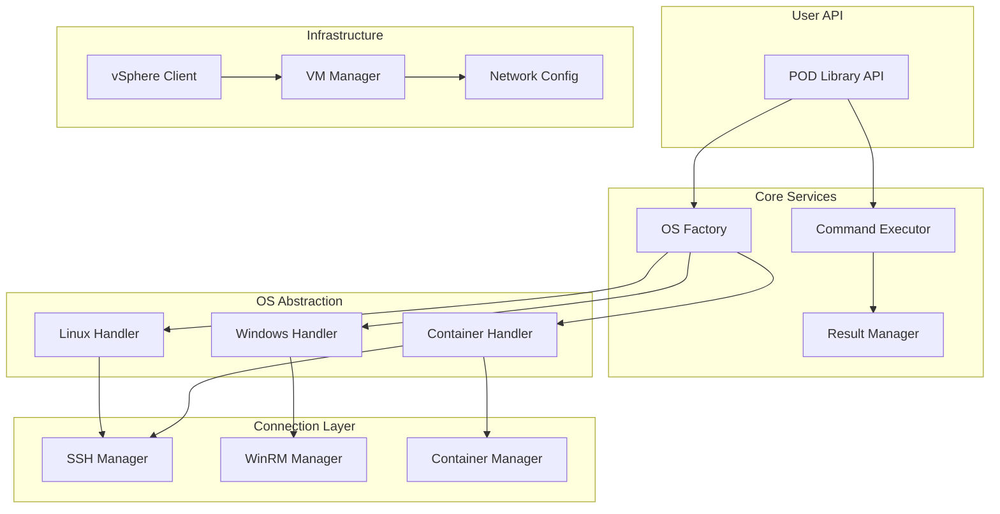

# POD Architecture Documentation

**Note**: This file has been superseded by the new [ARCHITECTURE.md](ARCHITECTURE.md) document which provides comprehensive architectural documentation for the current implementation.

The content below represents the original architectural design and may not reflect the current state of the codebase.

## Core Components

### 1. Infrastructure Layer
```
pod/
├── infrastructure/
│   ├── vsphere/
│   │   ├── client.py          # vSphere API wrapper
│   │   ├── vm_manager.py      # VM lifecycle management
│   │   └── network_config.py  # VLAN and network adapter config
│   └── providers/
│       ├── base.py           # Abstract provider interface
│       └── vsphere.py        # vSphere implementation
```

### 2. Connection Layer
```
pod/
├── connections/
│   ├── base.py              # Abstract connection interface
│   ├── ssh.py               # SSH connection (Linux/containers)
│   ├── winrm.py             # WinRM connection (Windows)
│   └── container.py         # Container-specific connections
```

### 3. OS Abstraction Layer
```
pod/
├── os_abstraction/
│   ├── base.py              # Base OS interface
│   ├── linux.py             # Linux operations
│   ├── windows.py           # Windows operations
│   ├── rocky_container.py   # Rocky Linux 9 container ops
│   └── factory.py           # OS detector and factory
```

### 4. Command Execution Engine
```
pod/
├── execution/
│   ├── command.py           # Command abstraction
│   ├── result.py            # Normalized result objects
│   └── executor.py          # Execution orchestration
```

### 5. Network Configuration
```
pod/
├── network/
│   ├── base.py              # Network config interface
│   ├── linux_network.py     # Linux network operations
│   ├── windows_network.py   # Windows network operations
│   └── vlan_manager.py      # VLAN configuration
```

## Architecture Diagram



## Key Design Principles

### 1. Unified Interface
All OS operations return normalized results regardless of the underlying OS:
```python
# Same interface for all OS types
result = pod_client.execute_command("ipconfig" if windows else "ip addr")
result.stdout  # Normalized output
result.success # Boolean status
result.data    # Parsed structured data
```

### 2. OS Detection and Auto-Configuration
```python
# Automatic OS detection
vm = pod_client.get_vm("test-vm-01")
vm.os_type  # Automatically detected: 'linux', 'windows', 'rocky-container'
```

### 3. Network Abstraction
```python
# Same API for all OS types
vm.configure_network(
    vlan_id=100,
    ip_address="192.168.100.10",
    netmask="255.255.255.0",
    gateway="192.168.100.1"
)
```

### 4. Connection Pooling and Management
- Persistent SSH/WinRM connections
- Automatic reconnection on failure
- Connection health monitoring

## Technology Stack

### Core Dependencies
- **pyvmomi**: vSphere API Python SDK
- **paramiko**: SSH connections
- **pywinrm**: Windows Remote Management
- **docker-py**: Container management
- **netmiko**: Network device connections (future)

### Supporting Libraries
- **pydantic**: Data validation and settings
- **asyncio**: Asynchronous operations
- **click**: CLI interface
- **pytest**: Testing framework

## Security Considerations

### 1. Credential Management
- Environment variable support
- Encrypted credential storage
- Vault integration (HashiCorp Vault, Azure Key Vault)

### 2. Connection Security
- SSH key-based authentication
- Kerberos support for Windows
- TLS/SSL for all connections

### 3. Audit and Logging
- Comprehensive audit trails
- Command execution logging
- Security event tracking

## Scalability Features

### 1. Connection Pooling
```python
# Reuse connections across operations
with pod_client.connection_pool(max_connections=10) as pool:
    for vm in vms:
        pool.execute_async(vm, commands)
```

### 2. Batch Operations
```python
# Execute commands on multiple VMs
results = pod_client.batch_execute(
    vms=['vm1', 'vm2', 'vm3'],
    commands=['configure_vlan', 'run_test']
)
```

### 3. Async Support
```python
# Asynchronous operations
async with pod_client.async_session() as session:
    tasks = [session.configure_vm(vm) for vm in vm_list]
    results = await asyncio.gather(*tasks)
```

## Error Handling Strategy

### 1. Graceful Degradation
- Automatic retry with exponential backoff
- Fallback mechanisms for network issues
- Clear error messages with remediation steps

### 2. OS-Specific Error Mapping
```python
# Normalized error codes across OS types
try:
    vm.configure_network(vlan=100)
except NetworkConfigError as e:
    print(f"Error: {e.code}")  # Same error code for all OS types
    print(f"Details: {e.details}")  # OS-specific details
```

## Performance Optimization

### 1. Caching
- VM metadata caching
- Connection state caching
- Command result caching (configurable)

### 2. Parallel Execution
- Thread pool for concurrent operations
- Async I/O for network operations
- Batch API calls to vSphere

### 3. Resource Management
- Connection limits per host
- Memory-efficient result streaming
- Automatic resource cleanup

## Monitoring and Observability

### 1. Metrics Collection
- Operation success/failure rates
- Connection pool statistics
- Command execution times

### 2. Health Checks
```python
# Built-in health monitoring
health = pod_client.health_check()
print(health.vsphere_status)
print(health.connection_pool_stats)
print(health.vm_availability)
```

### 3. Integration Points
- Prometheus metrics export
- OpenTelemetry support
- Custom metric collectors

## Future Extensibility

### 1. Plugin Architecture
```python
# Easy to add new OS support
@pod.register_os_handler('freebsd')
class FreeBSDHandler(BaseOSHandler):
    def configure_network(self, config):
        # FreeBSD-specific implementation
```

### 2. Provider Abstraction
- Easy to add AWS EC2, Azure VM support
- Consistent interface across cloud providers
- Hybrid cloud support

### 3. Network Device Integration
- CMTS control integration
- Cable modem management
- ONU configuration support